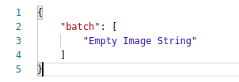
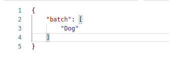
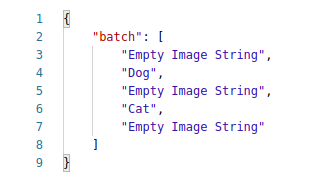

# Cat-Vs-Dog-Classification-Api
A flask webapp to classify the Cat Vs Dog in a List of Images.The web app is capable to handle a single as well a batch of images, it takes input as a dictionary containing list of image in base64 format
. 

## Description: 
 I have done transfer learning using inception v3 for Dog vs Cat classification. Api takes the input of a single or a batch of image in base64 format.

 Code is writen to handle the exception as well, the following are the some usecases:

 1. If we passed the dictionary contains the empty list - It will return Empty Output

 2. If list of images also contains some empty string - It will show (Empty Image String)


The base64 image is converted into file and saved as a png for further classification.
Classification function will predict for all the images passed and return the output
The input and output are given in POST method at url:http://0.0.0.0:5000/

## Sample Input 
Body: {
"batch":[“List of images in base64 format”]
}

## Sample Ouput

## No image

## Single image

## Multiple image 

## Back_End: 
Python, Flask  

## Libraries_used: 

### Flask libraries
<pre>
from flask import Flask, request
</pre>
### lib for base64 to image conv
<pre>
import base64
</pre>

## RUN: 
0. Download model from the google drive from given link below
<pre>https://drive.google.com/drive/folders/1uV6j5uJV5g-18VmKB_mRl2lD1PUWHUXR?usp=sharing</pre>
1. Clone the repo   
2. Create environment  
3. pip install -r requirement.txt
4. change dir path inside project according to your model location.
4. python app.py  

